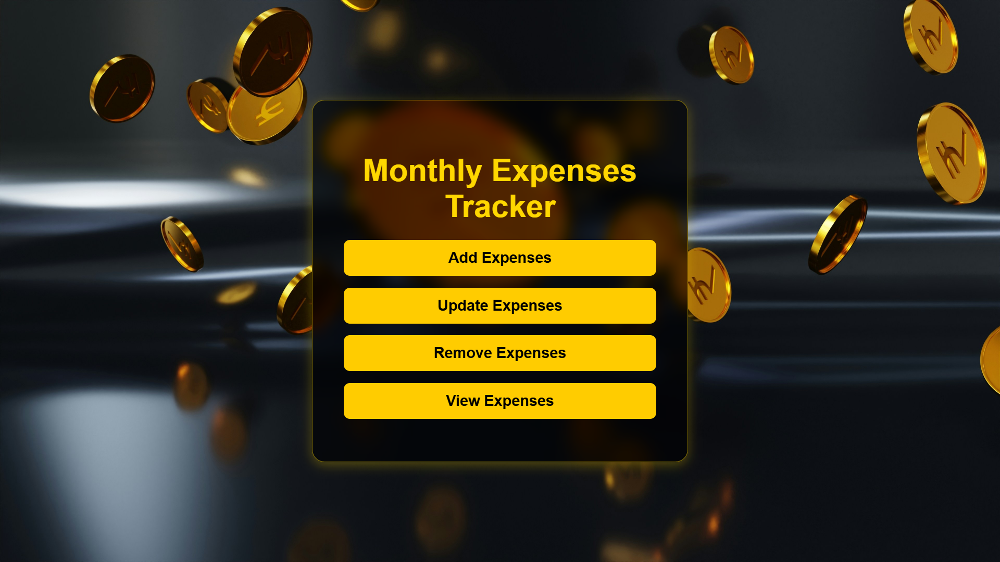

# Monthly Expenses Tracker

## Description:
The **Monthly Expenses Tracker** provides a simple and efficient way to manage your personal or business expenses. With an intuitive UI and easy-to-use buttons, users can add, update, remove, and view their expense history.

## Features:
- **Add Expenses**: Input and record your monthly expenses.

- **Update Expenses**: Modify previously recorded expenses.

- **Remove Expenses**: Delete unnecessary or incorrect expense entries.

- **View Expenses**: Get a detailed view of your expense records.

## Technologies Used:
- **UI Design**: Dark theme with golden accents for a premium look.
- **Graphics**: Animated floating coins for an engaging experience.
- **Backend**: Java and Servlets